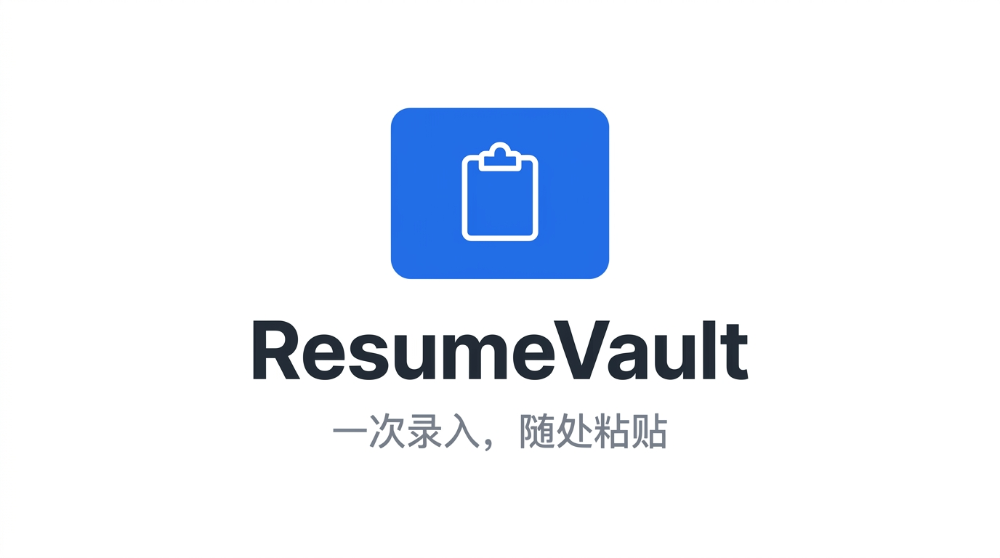
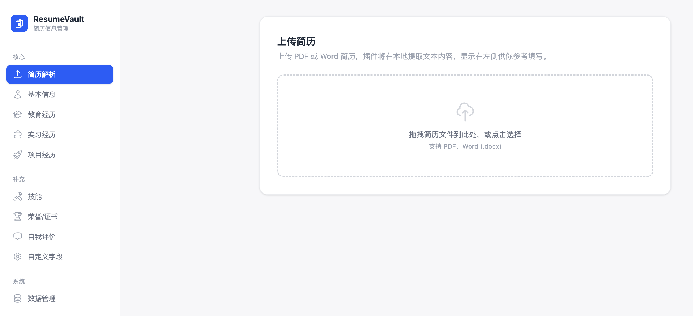
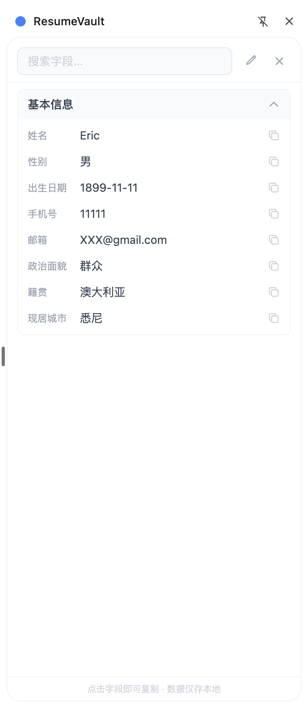

<div align="center">



**简历信息本地存储与一键复制的浏览器扩展，告别重复填写校招表单。**

[![Chrome][chrome-badge]][chrome-link] [![Edge][edge-badge]][edge-link] [![License][license-badge]][license-link]

[chrome-badge]: https://img.shields.io/badge/Chrome-Manifest_V3-4285F4?logo=googlechrome&logoColor=white
[chrome-link]: https://chrome.google.com/webstore
[edge-badge]: https://img.shields.io/badge/Edge-Supported-0078D7?logo=microsoftedge&logoColor=white
[edge-link]: https://microsoftedge.microsoft.com/addons
[license-badge]: https://img.shields.io/badge/License-MIT-green
[license-link]: #license

</div>

---

## Why ResumeVault?

校招季需要在各大招聘网站反复填写相同的个人信息，而网站自带的简历解析往往**识别效果差、格式混乱**，每次都要打开简历手动复制粘贴。

ResumeVault 让你 **一次录入，随处粘贴** —— 所有信息保存在浏览器本地，随时一键复制到任何网站的表单中。

## Features

<table>
<tr>
<td width="50%">

### 📋 信息管理

- 基本信息 / 教育经历 / 实习经历
- 项目经历 / 技能 / 荣誉证书
- 自我评价 / 自定义字段
- 支持上传 PDF / Word 提取文本参考

</td>
<td width="50%">

### ⚡ 快速访问

- **侧边栏常驻** — 任何网页旁边实时查看
- **快捷键** — `Alt+Shift+V` 一键开关（可自定义）
- **一键复制** — 点击字段即复制到剪贴板

</td>
</tr>
<tr>
<td width="50%">

### 🔒 隐私优先

- 数据 100% 本地存储
- 不联网、不调用 AI、不上传任何服务器
- 简历文件解析完全在本地完成

</td>
<td width="50%">

### 💾 数据管理

- 导出 JSON 备份
- 从 JSON 文件恢复
- 一键清空所有数据

</td>
</tr>
</table>

## Preview

|        选项页 — 完整信息编辑         |         侧边栏 — 快速查看与复制          |
| :----------------------------------: | :--------------------------------------: |
|  |  |

## Getting Started

### 从源码安装（开发者模式）

```bash
# 1. 克隆仓库
git clone https://github.com/LQF-dev/ResumeVault.git
cd ResumeVault

# 2. 安装依赖
npm install

# 3. 构建
npm run build
```

4. 打开 Chrome，访问 `chrome://extensions/`
5. 开启右上角 **开发者模式**
6. 点击 **加载已解压的扩展程序**，选择 `dist` 目录

### Chrome 商店安装

> 在 Chrome Web Store 安装：  
> [ResumeVault 扩展](https://chromewebstore.google.com/detail/jpbfnkmmjmehahdmihahjpehcoanellm?utm_source=item-share-cb)

## Usage

| 步骤  | 操作                                                     |
| :---: | -------------------------------------------------------- |
| **1** | 点击工具栏图标 → 上传简历或手动填写 → 保存               |
| **2** | 访问任意招聘网站 → 按 `Alt+Shift+V` 或点击图标打开侧边栏 |
| **3** | 点击需要的字段 → 自动复制 → `Ctrl+V` 粘贴到表单          |

> 自定义快捷键：访问 `chrome://extensions/shortcuts`（Edge 为 `edge://extensions/shortcuts`）

## Tech Stack

|     | 技术               | 版本 |
| --- | ------------------ | ---- |
| ⚛️  | React              | 19   |
| 🔷  | TypeScript         | 5    |
| 🎨  | Tailwind CSS       | 4    |
| ⚡  | Vite               | 6    |
| 🧩  | @crxjs/vite-plugin | 2    |
| 📄  | pdfjs-dist         | 5    |
| 📝  | mammoth            | 1    |

## Project Structure

```
src/
├── background/       # Service Worker (快捷键 toggle、Port 状态追踪)
├── components/       # 共享 UI 组件 (InfoCard, Icons, Toast...)
├── hooks/            # React Hooks (useStorage, useCopy)
├── options/          # 选项页 — 完整信息管理界面
├── popup/            # 弹窗 — 入口导航
├── services/         # PDF / DOCX 本地解析
├── sidepanel/        # 侧边栏 — 快速查看与一键复制
├── types/            # TypeScript 类型定义
└── manifest.ts       # Chrome Extension Manifest V3 配置
```

## Development

```bash
npm run dev     # 开发模式（HMR 热更新）
npm run build   # 生产构建
```

开发模式下在 `chrome://extensions/` 加载 `dist` 目录即可实时调试。

## Privacy

ResumeVault 的所有数据均存储在浏览器本地（`chrome.storage.local`）。

- ✅ 不收集任何用户数据
- ✅ 不发送任何网络请求
- ✅ 简历解析完全在客户端完成
- ✅ 卸载扩展即彻底删除所有数据

## License

[MIT](./LICENSE) &copy; 2026 QinFeng Luo
